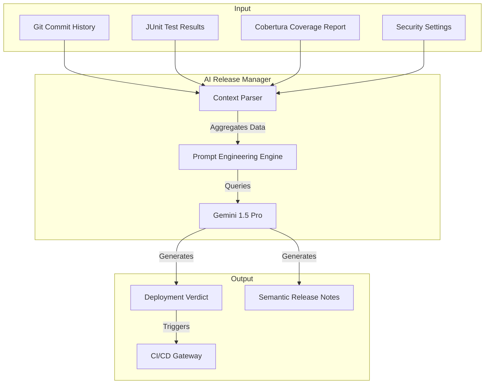

# AI Release Manager

The AI Release Manager is an advanced, autonomous quality gate designed for high-stakes CI/CD pipelines. Acting as a virtual Site Reliability Engineer (SRE), it leverages the Google Gemini 1.5 Pro model to perform semantic analysis of build artifacts.

Unlike traditional static analysis tools that rely solely on hard thresholds, this system understands the context of code changes, test failures, and security configurations to provide a comprehensive "Go/No-Go" decision for production deployments.

## Core Capabilities

### 1. Context-Aware Decision Engine
The manager aggregates data from multiple sources to render a final verdict:
- **Test Intelligence**: Parses JUnit XML reports to evaluate pass/fail rates and execution time stability.
- **Code Coverage Enforcement**: Validates line coverage against strict targets (default > 75%).
- **Security Auditing**: Scans configuration files to ensure critical security constants (like Face Verification Thresholds) remain within safe limits.

### 2. Dual-Mode Interface
- **CLI Mode**: Optimized for CI/CD environments (GitHub Actions, GitLab CI) to block or promote builds automatically.
- **MCP Server Mode**: Implements the Model Context Protocol, allowing external AI agents (such as Claude Desktop or IDE extensions) to query the repository's health status interactively.

## System Architecture

The system orchestrates data flow between the version control system, build artifacts, and the LLM reasoning engine.



## Installation

Requires Python 3.10 or higher.

1.  **Clone the repository**:
    ```bash
    git clone https://github.com/firasyazid/AI-release-Manager--MCP-.git
    ```

2.  **Install dependencies**:
    ```bash
    pip install -r requirements.txt
    ```

3.  **Environment Setup**:
    Export your Google Gemini API key:
    ```bash
    export GEMINI_API_KEY="your_api_key_here"
    ```

## Integration Guide

### Running in CI/CD (CLI Mode)

Execute the client script towards the end of your build pipeline. It requires paths to the generated test and coverage artifacts.

```bash
python src/client.py \
    --artifacts ./path/to/build/artifacts \
    --repo-root ./path/to/git/repo
```

### Generated Outputs

Upon completion, the manager generates two critical artifacts in the specified output directory:

1.  **`release_decision.json`**: A machine-readable file containing the specific verdict (APPROVED/REJECTED), confidence score, and detailed metric breakdown.
2.  **`release_notes.md`**: A human-readable Markdown document summarizing the changes in the latest commits, ready for publication to your changelog or release page.

### Running as an Agent (MCP Mode)

To expose the toolset to an external AI assistant:

```bash
python src/server.py
```

This starts the Model Context Protocol server on Stdio, enabling connected agents to utilize the project's logic tools (parsing, config reading, git analysis) directly.

## Configuration

The decision logic is governed by configurable constants within `src/client.py`:

-   **`MIN_COVERAGE_THRESHOLD`** (Default: 0.75): The absolute minimum code coverage percentage required for approval.
-   **`MAX_FACE_THRESHOLD`** (Default: 0.55): The maximum allowable distance for face verification. Values exceeding this are considered a critical security risk.
